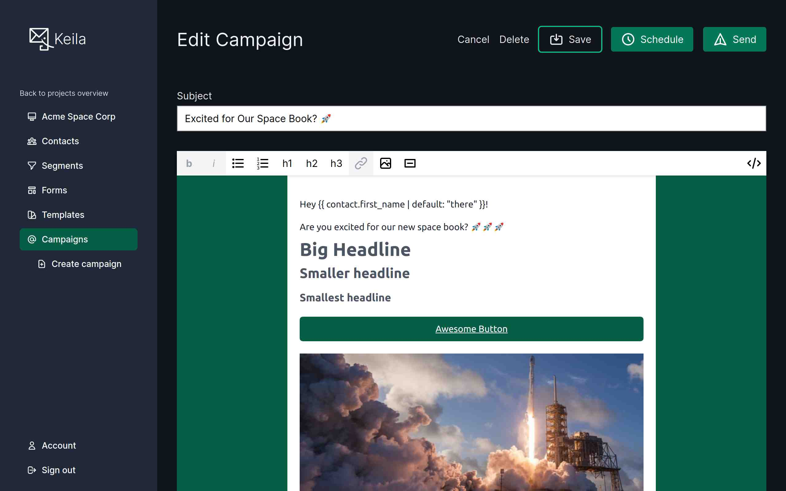

  
#  Keila - An Open Source Newsletter Tool

Keila is an Open Source alternative to newsletter tools like Mailchimp or
Sendinblue.

With Keila you can easily send out newsletter campaigns and create sign-up
forms.

For smaller newsletters, you can use your own email inbox to send out campaigns.
For larger newsletter projects, AWS SES, Sendgrid, and Mailgun are supported in addition
to SMTP.

## Giving Keila a Try

You can give a hosted version of Keila a try at [keila.io/try](https://www.keila.io/try).

If you want to deploy Keila on your own server, you can use the official Docker
image `pentacent/keila` or use the [sample Docker Compose config](ops/docker-compose.yml)
in this repo.

Follow the [Installation Docs](https://keila.io/docs/installation)
for more details.

## Developing Keila

If you want to give Keila a try, here’s how to get it running from this
repository:

* [Install Elixir](https://elixir-lang.org/install.html) and make sure you have [PostgreSQL](https://www.postgresql.org/) running on your machine
* Clone the repository:
  `git clone https://github.com/pentacent/keila.git`
* Install dependencies with `mix deps.get`
* Install dependencies and set up the database with `mix setup`
* Start Keila server with `mix phx.server`

Now you can visit [`localhost:4000`](http://localhost:4000) from your browser.

## (Optional) Developing Keila inside a [DevContainer](https://code.visualstudio.com/docs/remote/containers)

Here’s how to get it running using DevContainer from Visual Code:

* Install [Remote Container](https://github.com/microsoft/vscode-dev-containers) extension in Visual Code
* Click on the bottom left corner with the icon below and choose `Reopen in Container`

* Wait for the containers to build and install all the dependencies needed to run Keila, including [PostgreSQL](https://www.postgresql.org/) and [Elixir](https://elixir-lang.org/install.html)
* Open a terminal inside the container and proceed to run the commands from [Developing Keila](#developing-keila) section

## The Name
Keila is the name of the elephant mascot of this project.
She’s a wise and diligent elephant lady, able to remember countless email
addresses and contact names.
Fun fact: Keila loves going on holiday trips to the lakes of Finland.

## License
Keila is free software. You can redistribute it and/or modify
it under the terms of the GNU Affero General Public License as
published by the Free Software Foundation, either version 3 of the
License, or (at your option) any later version.

For more details, please [read the full license here](LICENSE.md).

Please note that the Keila logo is not subject to the aforementioned license.

